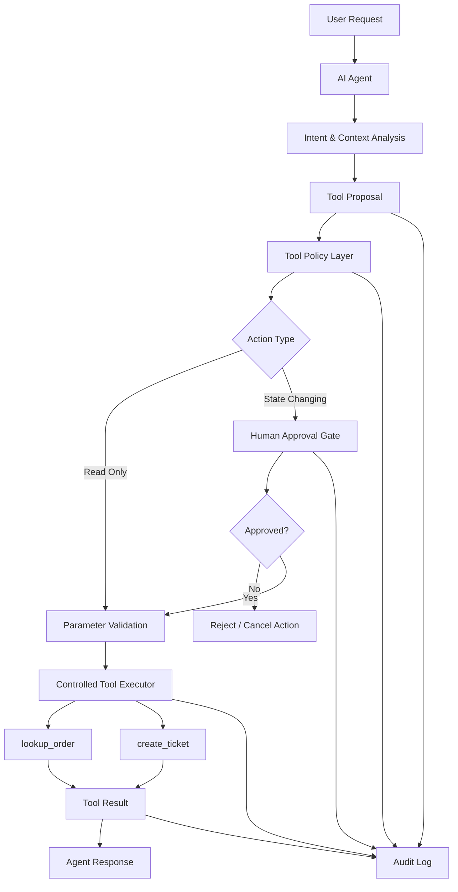
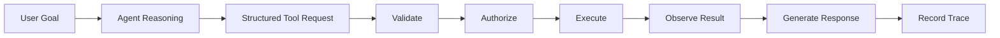
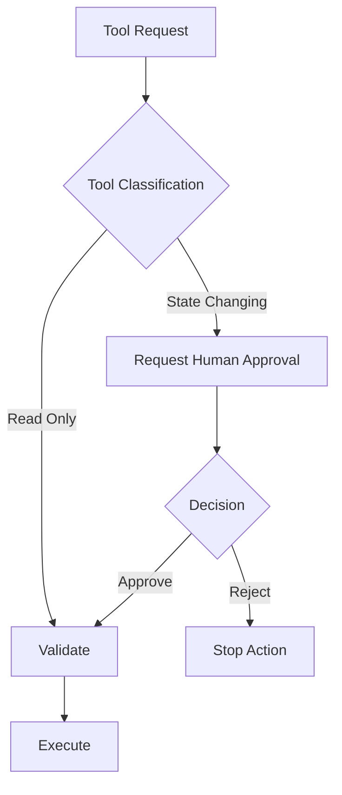
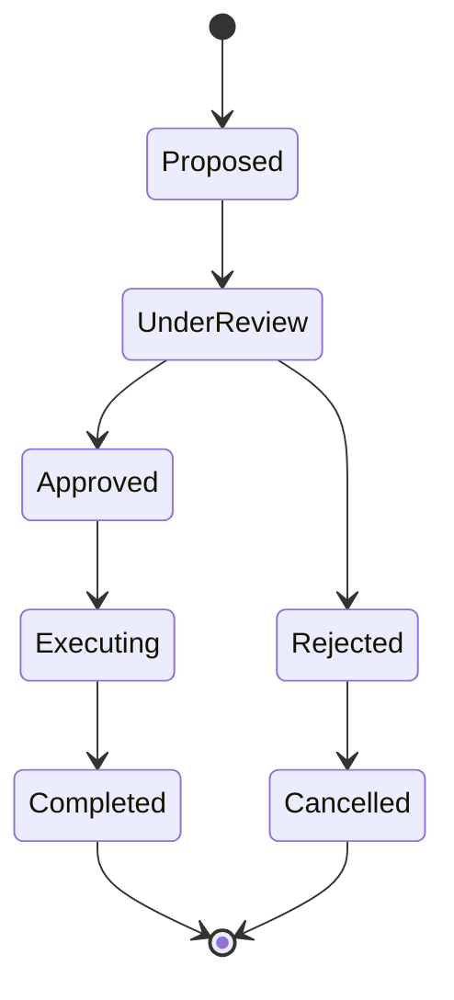
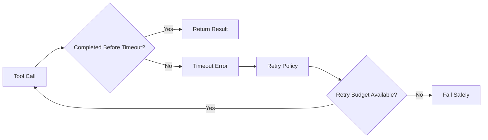
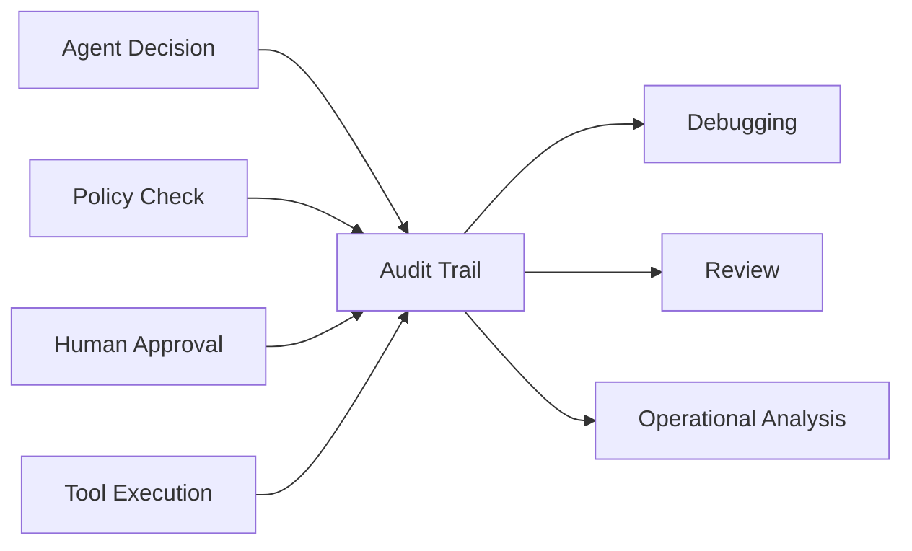
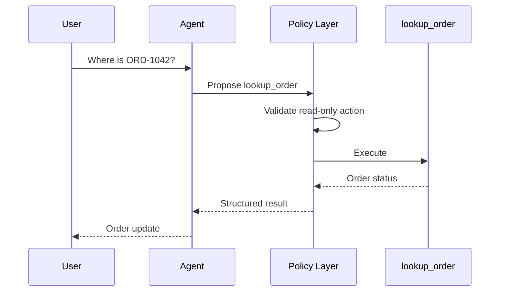
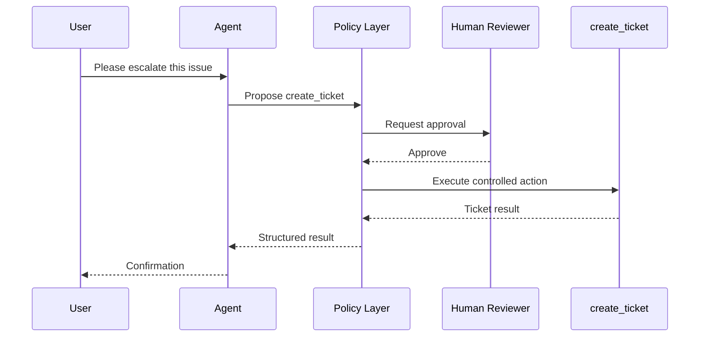

<div align="center">

# Controlled Order Agent

### Governed Tool-Using AI Agent for Order Support & Controlled Actions

**Agentic AI · Tool Calling · Human-in-the-Loop · Idempotency · Auditability · Reliability Engineering**

A controlled AI-agent architecture for handling **order-support workflows** while keeping consequential actions behind deterministic execution boundaries, approval gates, reliability controls, and auditable tool calls.

[Overview](#overview) ·
[Architecture](#high-level-architecture) ·
[Tool Model](#tool-model) ·
[Approval](#human-in-the-loop-approval) ·
[Reliability](#reliability-controls) ·
[Security](#security--control-principles) ·
[Limitations](#limitations)

</div>

---

## Overview

**Controlled Order Agent** demonstrates how a tool-using AI agent can assist with customer-order workflows without giving the language model unrestricted operational authority.

The central design principle is simple:

> **The model may propose an action, but the runtime decides whether that action is allowed to execute.**

The project separates:

- Language-model reasoning
- Tool selection
- Policy enforcement
- Human approval
- Tool execution
- Reliability controls
- Audit logging

This architecture turns a simple order-support agent into a demonstration of **bounded agent autonomy**.

The current workflow centers on two representative tools:

- `lookup_order` — read-only order retrieval
- `create_ticket` — state-changing support action

Read operations can be executed through a controlled tool boundary, while write operations can require explicit human approval before execution.

---

## Why Controlled Agents?

A basic tool-calling agent often follows this pattern:

```text
User Request
     ↓
LLM
     ↓
Tool Call
     ↓
Execution
```

That architecture is easy to build, but it gives the model too much implicit authority.

A production-oriented agent requires additional control layers:

```text
Reason
   ↓
Propose
   ↓
Validate
   ↓
Authorize
   ↓
Execute
   ↓
Verify
   ↓
Record
```

Controlled Order Agent demonstrates this second pattern.

The goal is not maximum autonomy.

The goal is **useful autonomy inside explicit engineering boundaries**.

---

## Key Capabilities

### Agentic Reasoning

- Natural-language request interpretation
- Tool selection
- Structured tool arguments
- Multi-step task handling
- Tool-result reasoning
- Controlled response generation

### Tool Governance

- Explicit tool allowlist
- Read vs. write action separation
- Parameter validation
- Policy checks before execution
- Least-privilege tool access
- Controlled execution boundary

### Human Oversight

- Human-in-the-loop approval for consequential actions
- Approval before state-changing execution
- Rejection path
- Safe cancellation
- Separation between model intent and execution authority

### Reliability

- Bounded retry behavior
- Timeout handling
- Idempotency protection
- Duplicate-action prevention
- Structured failure handling
- Controlled fallback behavior

### Auditability

- Tool-call logging
- Action parameters
- Approval decisions
- Execution outcome
- Failure information
- Traceable agent workflow

---

# High-Level Architecture



The language model never directly performs external side effects.

It proposes a structured action, while deterministic application logic controls whether that action is permitted and executed.

---

## Execution Model

The controlled execution lifecycle follows:



Each stage has a different responsibility.

| Stage | Responsibility |
|---|---|
| **Reason** | Interpret the user request |
| **Propose** | Select a tool and structured arguments |
| **Validate** | Verify tool and parameter correctness |
| **Authorize** | Apply policy and approval requirements |
| **Execute** | Run permitted tool action |
| **Observe** | Capture result or failure |
| **Respond** | Generate user-facing answer |
| **Record** | Preserve execution evidence |

This separation reduces the amount of authority delegated directly to the model.

---

# Tool Model

Tools are treated as **explicit capabilities**, not arbitrary functions exposed to the language model.

The agent should only know about the minimum set of actions required for its task.

---

## `lookup_order`

### Purpose

Retrieve information about an existing customer order.

### Classification

**Read-only**

### Typical use

```text
User:
"Where is order ORD-1042?"

        ↓

Agent proposes:

lookup_order(
    order_id="ORD-1042"
)
```

Because the operation is read-only, it can be executed through the controlled runtime after validation.

---

## `create_ticket`

### Purpose

Create a support ticket when an issue requires escalation or human follow-up.

### Classification

**State-changing / consequential**

### Typical use

```text
User:
"My order arrived damaged. Please escalate this."

        ↓

Agent proposes:

create_ticket(...)
```

Unlike a read-only lookup, ticket creation changes external system state.

The proposed action therefore passes through the approval boundary before execution.

---

## Read vs. Write Separation



This distinction is one of the most important safety boundaries in the system.

---

# Human-in-the-Loop Approval

The agent is allowed to **propose** consequential actions.

It is not allowed to approve those actions itself.

The approval workflow follows:



The reviewer should be able to inspect:

- Proposed tool
- Tool arguments
- User request
- Expected action
- Relevant context
- Potential side effect

before approving execution.

---

## Why Approval Happens Outside the Model

The language model must not be able to generate:

```text
"I approve this action."
```

and thereby authorize itself.

Approval is an application-level control.

Conceptually:

```text
LLM Authority:
    propose()

Runtime Authority:
    validate()
    authorize()
    execute()

Human Authority:
    approve()
    reject()
```

This ensures that reasoning authority and execution authority remain separate.

---

# Reliability Controls

Agent systems interact with models, APIs, tools, and users.

All of these components can fail.

Controlled Order Agent therefore treats reliability as part of the agent architecture rather than an afterthought.

---

## Idempotency

State-changing operations must be protected from accidental duplicate execution.

A typical failure scenario is:

```text
create_ticket()
      ↓
Ticket Created
      ↓
Network Timeout
      ↓
Agent Retries
      ↓
create_ticket()
```

Without idempotency, this could create two support tickets.

The desired behavior is:

```text
Request + Idempotency Key
          ↓
Already Executed?
      ┌───┴───┐
     Yes      No
      │        │
Cached Result Execute
      │        │
      └───┬────┘
          ↓
       Result
```

The same logical operation should not create duplicate side effects when retried.

---

## Timeout Handling

External tools may become slow or unavailable.

Tool execution should therefore have explicit time limits.



A tool should never be allowed to block agent execution indefinitely.

---

## Bounded Retries

Retries should be:

- Limited
- Explicit
- Observable
- Applied only where safe

Read operations are generally easier to retry.

State-changing operations require idempotency protection before retrying.

---

## Failure Handling

Failures should return structured outcomes rather than raw stack traces to the agent.

Conceptually:

```text
Tool Failure
    ↓
Classify Error
    ↓
Retryable?
   /    \
 Yes    No
  │      │
Retry   Fail Safely
  │      │
  └──┬───┘
     ↓
Structured Observation
     ↓
Agent Response
```

This allows the model to reason about failures without receiving unnecessary implementation details.

---

# Security & Control Principles

## Least Privilege

The agent receives only the tools required for its task.

It should not receive broad application, database, or administrative access simply because that access is available.

```text
Agent
 ├── lookup_order    ✓
 ├── create_ticket   ✓ controlled
 ├── delete_orders   ✗
 ├── admin_database  ✗
 └── arbitrary_shell ✗
```

Capability exposure is intentionally narrow.

---

## Explicit Tool Allowlist

Only registered tools can be requested.

Unknown or unauthorized tool names should be rejected before execution.

---

## Deterministic Policy Boundary

Security-critical decisions should be implemented in application logic rather than delegated entirely to prompt instructions.

The model may reason about whether an action is appropriate.

The runtime determines whether the action is actually permitted.

---

## Parameter Validation

Tool arguments should be validated before execution.

Examples include:

- Required fields
- Identifier format
- Allowed value ranges
- Supported action types
- Missing parameters

Invalid actions should fail before reaching the underlying tool.

---

## Controlled Side Effects

Consequential actions should have stronger controls than read-only actions.

This can include:

- Human approval
- Idempotency keys
- Rate limits
- Explicit policy checks
- Additional logging

---

# Auditability

Every significant agent action should leave an observable trace.

A useful execution record can include:

```text
Timestamp
Session / Request ID
User Request
Agent Decision
Tool Name
Tool Arguments
Policy Decision
Approval Decision
Execution Result
Latency
Error / Retry Information
```

---

## Audit Flow



Auditability helps answer:

> What did the agent attempt to do?

> Why was the action allowed?

> Who approved it?

> What tool actually executed?

> What happened afterward?

---

# Example Workflows

## Order Lookup



No approval is required because the action is read-only.

---

## Ticket Creation



The language model proposes the action, but execution only occurs after approval.

---

# Reliability Model

The project demonstrates several principles required for dependable tool-using agents.

| Concern | Control |
|---|---|
| Unrestricted actions | Explicit tool allowlist |
| Invalid arguments | Parameter validation |
| Sensitive write operations | Human approval |
| Duplicate execution | Idempotency |
| Hanging tool calls | Timeouts |
| Temporary failures | Bounded retries |
| Excessive permissions | Least privilege |
| Hidden agent behavior | Audit logging |
| Unsafe failures | Fail-safe execution |

---

## Engineering Principles

### Model Reasoning ≠ Execution Authority

The LLM decides what it would like to do.

The runtime decides what it is allowed to do.

---

### Read and Write Actions Are Different

Information retrieval and state mutation have different risk profiles and therefore different control requirements.

---

### Fail Closed

When authorization is unclear or approval is unavailable, consequential execution should stop rather than proceed optimistically.

---

### Bounded Autonomy

Autonomy is useful only when the permitted action space is clearly defined.

---

### Human Oversight Where It Matters

Human approval should be concentrated around actions with meaningful side effects rather than applied blindly to every reasoning step.

---

### Reliability Before Autonomy

Retries, timeouts, idempotency, validation, and observability are part of agent design—not optional production polish.

---

# Technology Concepts

| Area | Concepts |
|---|---|
| **AI Architecture** | Tool-Using Agent |
| **Agent Control** | Bounded Autonomy |
| **Tool Execution** | Structured Tool Calling |
| **Human Oversight** | Human-in-the-Loop Approval |
| **Reliability** | Timeout, Retry, Idempotency |
| **Security** | Least Privilege, Tool Allowlisting |
| **Observability** | Event / Audit Logging |
| **Domain** | Order Support & Escalation |

---

## Use Cases

The architecture can be adapted to other controlled agent workflows such as:

- Customer-support escalation
- IT support
- Internal operations
- Approval workflows
- Administrative assistants
- Enterprise automation
- Compliance-sensitive tool use

The specific order-support workflow serves as a compact demonstration of the broader controlled-agent pattern.

---

# Limitations

Controlled Order Agent is a **technical demonstration of governed agent execution**, not a complete production customer-support platform.

Current scope should not be interpreted as providing:

- Enterprise identity management
- Production authorization infrastructure
- Distributed workflow persistence
- Durable execution across process crashes
- Real CRM / ERP integration unless separately configured
- Production-grade secret management
- Advanced policy engines
- Distributed audit storage
- Formal security certification

The project demonstrates architectural controls and agent-engineering principles rather than claiming complete production infrastructure.

---

## Roadmap

Potential future development includes:

### Agent Governance

- Policy-as-code configuration
- Risk-based action classification
- Dynamic approval policies
- Role-based tool authorization
- Multi-level approval workflows

### Reliability

- Durable workflow state
- Exponential backoff
- Dead-letter handling
- Replayable execution
- Circuit breakers
- Failure injection tests

### Observability

- Structured JSON traces
- Tool latency dashboards
- Approval metrics
- Retry metrics
- Agent trajectory visualization
- OpenTelemetry integration

### Integrations

- Real order-management APIs
- CRM integration
- Ticketing platforms
- Authentication
- Persistent state storage

### Evaluation

- Tool-selection accuracy
- Argument-validity evaluation
- Approval-policy compliance
- Duplicate-action tests
- Failure-recovery scenarios
- Agent reliability benchmark suite

---

## Project Status

**Controlled Agent Demonstrator**

The project focuses on the engineering boundary between:

**LLM Reasoning**

and

**Authorized Real-World Execution**

with emphasis on:

- Tool calling
- Controlled actions
- Human approval
- Idempotency
- Failure handling
- Least privilege
- Auditability

---

## Author

**Amir Mohammad Mahmoudian**

AI Engineer focused on **agentic AI, applied AI systems, LLM applications, machine learning, and reliable AI engineering**.

[GitHub](https://github.com/mahmmooudian) ·
[LinkedIn](https://www.linkedin.com/in/amirmohmmadmahmoudian)

---

## License

See the repository license for usage and distribution terms.

---

<div align="center">

### Reason → Propose → Authorize → Execute → Verify → Record

**Building AI agents that can act without giving up control.**

If this repository is useful to your work or research, consider giving it a ⭐.

</div>
