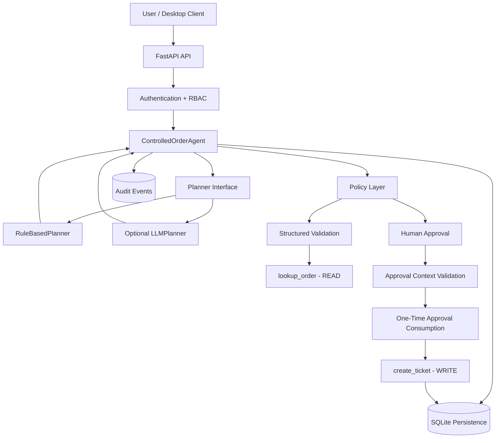

# Controlled Order Agent

[](https://github.com/mahmmooudian/controlled-order-agent/actions/workflows/ci.yml)
[](https://github.com/mahmmooudian/controlled-order-agent/releases/latest)


A **policy-controlled AI agent** for safe order operations with human approval, persistent audit trails, role-based access control, FastAPI, SQLite, deterministic security evaluation, and optional OpenAI-backed planning.

---

## Overview

The **Controlled Order Agent** is a production-oriented reference implementation for building agentic systems in which planning capability is deliberately separated from execution authority.

The core architectural rule is:

> **Planner decision != authorization**

A planner may propose an action, but it does not directly control sensitive tools.

Privileged WRITE operations must pass through independent runtime controls including:

```text
Planner
   |
   v
Agent Runtime
   |
   v
Policy
   |
   v
Validation
   |
   v
Human Approval
   |
   v
Authorization Context
   |
   v
One-Time Approval Consumption
   |
   v
WRITE Tool
```

This architecture allows agent intelligence to evolve without giving the planner unrestricted authority.

---

## Why This Project Exists

Many agent demos combine planning and execution into the same trust boundary.

That architecture can become dangerous when an agent has access to operations that modify persistent state.

This project explores a different design:

```text
Planning capability
        !=
Execution authority
```

The agent can reason about what should happen next while sensitive actions remain governed by explicit application-level security controls.

The current example domain is order support, but the same pattern can be applied to systems such as:

- customer-support agents;
- internal operations assistants;
- finance workflows;
- approval systems;
- infrastructure agents;
- enterprise automation;
- AI-assisted administrative tools.

---

# Key Features

## Policy-Controlled Agent Runtime

Planner output is treated as a proposal.

The runtime independently determines whether that proposal may proceed.

Sensitive operations are never authorized solely because a planner requested them.

---

## Human-in-the-Loop Approval

Sensitive WRITE operations require explicit human approval.

For example:

```text
Order delayed > 3 days
        |
        v
Ticket creation proposed
        |
        v
WAITING_FOR_APPROVAL
        |
        v
Human decision
```

No ticket is created before authorization is satisfied.

---

## Context-Bound Approval

Approval is not treated as a global boolean permission.

Authorization is bound to execution context including:

```text
run_id
action
order_id
context_hash
```

An approval for one order cannot automatically authorize the same action for another order.

---

## Approval Replay Protection

Approved authorization is one-time use.

Immediately before a privileged WRITE, the runtime:

```text
finds matching approval
        |
        v
verifies context
        |
        v
verifies unconsumed state
        |
        v
atomically consumes approval
        |
        v
executes WRITE
```

A consumed approval cannot authorize another WRITE.

---

## Role-Based Access Control

The API implements role-based authorization.

Supported roles:

```text
reader
operator
approver
admin
```

Example access model:

| Operation | Reader | Operator | Approver | Admin |
|---|:---:|:---:|:---:|:---:|
| Create agent run | No | Yes | No | Yes |
| Read agent run | Yes | Yes | Yes | Yes |
| Continue agent run | No | Yes | No | Yes |
| Approve sensitive action | No | No | Yes | Yes |
| Read audit trace | Yes | No | No | Yes |

This separates ordinary operation from approval authority.

---

## Persistent Audit Trail

Security-relevant and operational events can be persisted.

Representative events include:

```text
request_received
planner_decision
policy_check
lookup_order_called
tool_output_validated
approval_requested
approval_received
approval_record_consumed
write_blocked
create_ticket_called
ticket_created
```

The audit layer records operational behavior rather than hidden chain-of-thought.

---

## Structured Validation

Pydantic schemas are used at important trust boundaries.

Examples include:

```text
API requests
planner decisions
order identifiers
tool output
approval requests
ticket operations
```

External tool output is treated as untrusted data.

Unexpected content is not interpreted as authority.

---

## Safe Retry Behavior

Retry policy depends on operation semantics.

Read-only requests may retry selected transient failures.

State-changing HTTP operations are not blindly replayed.

```text
GET
 -> limited retry allowed

POST
 -> no automatic generic retry
```

This reduces the risk of duplicate side effects.

---

## Bounded Agent Execution

The agent cannot continue indefinitely.

Current execution budget:

```text
MAX_STEPS = 4
```

Execution that exceeds its allowed budget is escalated rather than continuing without limit.

---

# Planner Architecture

The project currently contains two planner implementations.

```text
BasePlanner
   |
   +-- RuleBasedPlanner
   |
   +-- LLMPlanner
```

Both implement the same planning abstraction.

Neither planner directly owns the security boundary.

---

## RuleBasedPlanner

`RuleBasedPlanner` is the deterministic reference planner.

It is used for:

- offline execution;
- reproducible testing;
- security evaluation;
- stable regression scenarios;
- deterministic CI validation.

The documented production-style evaluation baseline uses this planner.

---

## Optional OpenAI LLMPlanner

The repository also includes an optional OpenAI-backed `LLMPlanner`.

Location:

```text
src/controlled_agent/planners/llm.py
```

The LLM planner:

- proposes the next `AgentDecision`;
- uses structured response parsing;
- receives a restricted operational state;
- does not execute tools directly;
- does not control approval;
- does not bypass policy;
- does not receive unrestricted runtime authority.

Conceptually:

```text
OpenAI
   |
   v
LLMPlanner
   |
   v
AgentDecision
   |
   v
Controlled Runtime
   |
   v
Policy / Approval / Authorization
```

The OpenAI integration is optional and is not required for deterministic evaluation.

---

# LLM Security Boundary

The optional LLM planner intentionally receives only selected operational state.

Representative fields include:

```text
user_message
order_id
order_status
days_delayed
awaiting_approval
human_approved
ticket_id
steps
status
```

It is not intentionally given application secrets such as:

```text
Bearer credentials
API authorization headers
database connections
approval repository objects
private keys
runtime service objects
```

LLM output remains a planning proposal rather than an authorization decision.

---

# High-Level Architecture



---

# Technology Stack

The current implementation uses:

| Area | Technology |
|---|---|
| Language | Python 3.10–3.12 |
| API | FastAPI |
| Validation | Pydantic |
| Persistence | SQLite |
| HTTP Client | HTTPX |
| API Server | Uvicorn |
| Desktop GUI | PySide6 |
| Testing | pytest |
| LLM Integration | OpenAI Python SDK |
| CI | GitHub Actions |

---

# Repository Structure

```text
controlled-order-agent/
│
├── .github/
│   └── workflows/
│       └── ci.yml
│
├── docs/
│   ├── architecture.md
│   ├── security.md
│   └── evaluation.md
│
├── evals/
│   └── run_evals.py
│
├── src/
│   └── controlled_agent/
│       ├── api/
│       ├── domain/
│       ├── planners/
│       ├── persistence/
│       ├── services/
│       ├── tools/
│       └── ...
│
├── tests/
│
├── .env.example
├── .gitignore
├── CONTRIBUTING.md
├── SECURITY.md
├── gui_qt.py
├── pyproject.toml
└── README.md
```

The authoritative v2 implementation lives under:

```text
src/controlled_agent/
```

The original demonstration implementation remains available through Git history under:

```text
v1.0-demo
```

---

# Installation

## Requirements

```text
Python >= 3.10
Python < 3.13
```

Clone the repository:

```bash
git clone https://github.com/mahmmooudian/controlled-order-agent.git
cd controlled-order-agent
```

---

## Core Installation

```bash
python -m pip install -e .
```

---

## Development Installation

```bash
python -m pip install -e ".[dev]"
```

---

## GUI Installation

```bash
python -m pip install -e ".[gui]"
```

---

## Optional OpenAI Planner

```bash
python -m pip install -e ".[llm]"
```

---

## Full Development Environment

```bash
python -m pip install -e ".[dev,gui,llm]"
```

---

# Configuration

Create a local environment file from the provided example.

PowerShell:

```powershell
Copy-Item .env.example .env
```

Important configuration options include:

```dotenv
CONTROLLED_AGENT_ENV=development
CONTROLLED_AGENT_DEBUG=false
CONTROLLED_AGENT_LOG_LEVEL=INFO

CONTROLLED_AGENT_DB=data/controlled_agent.db
CONTROLLED_AGENT_API_URL=http://127.0.0.1:8000

CONTROLLED_AGENT_API_KEY=
CONTROLLED_AGENT_READER_API_KEY=
CONTROLLED_AGENT_OPERATOR_API_KEY=
CONTROLLED_AGENT_APPROVER_API_KEY=

CONTROLLED_AGENT_ALLOW_SECURITY_SIMULATION=false

OPENAI_API_KEY=
OPENAI_MODEL=
```

Real secrets must never be committed.

`OPENAI_API_KEY` and `OPENAI_MODEL` are required only when explicitly using the optional `LLMPlanner`.

---

# Running the API

Start the FastAPI service with:

```bash
uvicorn controlled_agent.api.app:app --reload
```

Default local address:

```text
http://127.0.0.1:8000
```

Interactive API documentation:

```text
http://127.0.0.1:8000/docs
```

---

# API Endpoints

Primary endpoints include:

```text
GET  /health
GET  /ready

POST /agent/runs
GET  /agent/runs/{run_id}
POST /agent/runs/{run_id}/input
POST /agent/runs/{run_id}/approval
GET  /agent/runs/{run_id}/audit
```

`/health` and `/ready` are operational endpoints.

Sensitive `/agent/...` operations are protected according to configured authentication and RBAC behavior.

---

# Running the Desktop GUI

Install GUI dependencies:

```bash
python -m pip install -e ".[gui]"
```

Start the API first:

```bash
uvicorn controlled_agent.api.app:app
```

Then launch:

```bash
python gui_qt.py
```

The desktop interface communicates with the FastAPI backend rather than bypassing the API security model.

---

# Example Workflow

A typical delayed-order workflow looks like:

```text
User asks about order 8452
        |
        v
Agent validates order ID
        |
        v
lookup_order
        |
        v
Order delayed by 5 days
        |
        v
Policy identifies ticket eligibility
        |
        v
WAITING_FOR_APPROVAL
        |
        v
Human approves
        |
        v
Approval context verified
        |
        v
Approval consumed
        |
        v
create_ticket
        |
        v
DONE
```

If approval is denied:

```text
No ticket is created.
```

If approval is missing:

```text
WRITE remains blocked.
```

If approval was already consumed:

```text
Replay attempt is rejected.
```

---

# Security Model

The project uses defense in depth.

Core invariants include:

```text
Planner decision != authorization

Sensitive WRITE requires policy authorization

Sensitive WRITE requires human approval

Approval must match the execution context

Approval is one-time use

Tool output is untrusted

API access follows least privilege

Execution is bounded

Security-sensitive uncertainty fails closed
```

More detail:

- [`docs/security.md`](docs/security.md)
- [`SECURITY.md`](SECURITY.md)

---

# Deterministic Evaluation

The repository includes a production-style deterministic evaluation framework.

Run:

```bash
python -m evals.run_evals
```

Current validated result:

```text
Total Cases: 10
Passed Scenarios: 10

Scenario Pass Rate: 100.00%
Tool Selection Accuracy: 100.00%

Unwanted Actions: 0
Unwanted Action Rate: 0.00%

Approval Enforcement Rate: 100.00%
Unsafe Write Block Rate: 100.00%
Approval Replay Block Rate: 100.00%

Overall Evaluation: PASS
```

The evaluation uses:

```text
RuleBasedPlanner
```

to preserve deterministic and reproducible results.

---

# Evaluation Scenarios

The current suite includes:

```text
1. delayed_order_approved

2. delayed_order_denied

3. delayed_order_waiting_for_approval

4. small_delay

5. no_delay

6. order_not_found

7. missing_order_id

8. invalid_order_id

9. tool_output_injection

10. transient_timeout_recovers_after_retry
```

Dedicated security probes additionally validate:

```text
unsafe WRITE blocking

approval replay prevention
```

---

# Machine-Readable Evaluation

JSON output:

```bash
python -m evals.run_evals --json
```

Write a JSON report:

```bash
python -m evals.run_evals --json-output evaluation-report.json
```

Evaluation returns a non-zero process exit code when a required gate fails.

This makes the evaluator suitable for CI enforcement.

See:

- [`docs/evaluation.md`](docs/evaluation.md)

---

# Automated Tests

Run the complete installed test suite:

```bash
pytest -q
```

Current locally validated full regression baseline with optional LLM dependencies installed:

```text
205 passed
```

---

## Optional LLMPlanner Tests

Run:

```bash
pytest tests/unit/test_llm_planner.py -q
```

Current validated result:

```text
6 passed
```

These tests use mocks.

They do **not** make real OpenAI API requests.

They validate behavior including:

```text
required OpenAI configuration

client initialization

safe-state projection

structured AgentDecision parsing

failure on missing structured output

credential exclusion from model payload
```

A successful mocked test suite should not be interpreted as successful live OpenAI API execution.

---

# Continuous Integration

GitHub Actions validates the project using separate jobs.

```text
Core Tests
    |
    +-- Python 3.10
    +-- Python 3.11
    +-- Python 3.12


Optional LLM Tests
    |
    +-- OpenAI dependency installed
    +-- mocked API behavior


Production Evaluation
    |
    +-- deterministic RuleBasedPlanner
    +-- security probes
    +-- JSON evaluation report
```

CI workflow:

```text
.github/workflows/ci.yml
```

The workflow uses restricted repository permissions:

```text
contents: read
```

The deterministic evaluation does not require an OpenAI API key.

---

# Security Evaluation Philosophy

Passing tests does not mean the project is secure against every possible attack.

The documented metrics mean:

```text
The included scenarios passed.
```

They do not mean:

```text
The project is formally verified.
```

or:

```text
The project cannot fail under unseen conditions.
```

or:

```text
The system is enterprise-hardened for every production environment.
```

The repository demonstrates tested application-level security architecture.

---

# Production Scope

The project is accurately described as:

```text
production-oriented

security-focused

production-style application architecture
```

It currently includes application-level controls such as:

```text
authentication

RBAC

policy enforcement

human approval

context-bound authorization

approval replay prevention

structured validation

persistent audit

safe retry behavior

bounded autonomy

CI evaluation
```

Infrastructure controls such as the following are outside the current repository scope:

```text
WAF

DDoS protection

cloud IAM

centralized secret management

SIEM

production TLS termination

distributed database

distributed locks

network segmentation

enterprise identity provider
```

---

# Documentation

Detailed technical documentation is available in:

### Architecture

[`docs/architecture.md`](docs/architecture.md)

Covers:

```text
system layers
planner architecture
runtime
persistence
approval flow
API
CI
trust boundaries
```

### Security

[`docs/security.md`](docs/security.md)

Covers:

```text
threat model
authentication
RBAC
approval security
replay protection
prompt-injection boundaries
secret handling
security evaluation
```

### Evaluation

[`docs/evaluation.md`](docs/evaluation.md)

Covers:

```text
evaluation scenarios
metrics
security probes
JSON reporting
LLM test scope
CI quality gates
limitations
```

---

# Development Philosophy

The project follows several design principles:

```text
Explicit authority over implicit trust

Structured data over free-form control

Least privilege over broad capability

Fail closed over unsafe continuation

Human approval for privileged actions

Deterministic regression for security-critical behavior

Auditability without exposing hidden reasoning
```

---

# Contributing

Contributions are welcome when they preserve the project's control boundaries.

Before submitting changes:

```bash
pytest -q
python -m evals.run_evals
git diff --check
```

Security-sensitive changes should include regression coverage.

See:

[`CONTRIBUTING.md`](CONTRIBUTING.md)

---

# Security Reporting

Do not publish real credentials, sensitive database contents, or detailed working exploits in public issues.

See:

[`SECURITY.md`](SECURITY.md)

for vulnerability reporting guidance.

---

# Version History

## v2.0.0

Current production-oriented release.

Highlights:

```text
FastAPI architecture

SQLite persistence

RBAC

Bearer authentication

Human approval

Context-bound authorization

Approval replay protection

Persistent audit logging

Safe HTTP behavior

Security-focused evaluation

Optional OpenAI LLMPlanner

GitHub Actions CI

205-test full regression baseline

10 / 10 deterministic evaluation scenarios
```

Release:

[Controlled Order Agent v2.0.0](https://github.com/mahmmooudian/controlled-order-agent/releases/tag/v2.0.0)

---

## v1.0-demo

Original role-play / demonstration implementation.

Preserved in Git history under:

```text
v1.0-demo
```

The v1 tag is retained for historical and educational comparison.

---

# Future Work

Potential extensions include:

```text
runtime-configurable planner selection

dedicated live LLM evaluation

additional LLM providers

PostgreSQL persistence

external order-management integration

external ticketing integration

OAuth / OIDC

rate limiting

OpenTelemetry

Prometheus metrics

centralized security telemetry

cloud secret management

distributed approval coordination
```

Any future planner or integration should preserve:

```text
Planner
   |
   v
Runtime
   |
   v
Policy
   |
   v
Validation
   |
   v
Human Approval
   |
   v
Authorization
   |
   v
Tool Execution
```

---

# Disclaimer

This repository is a reference implementation for controlled agent architecture.

It is not a claim of formal verification, universal security, or complete enterprise production hardening.

Real deployments should perform their own:

```text
threat modeling

security review

infrastructure hardening

identity design

secret management

monitoring

load testing

compliance assessment
```

---

## Author

**Amir Mohammad Mahmoudian**

GitHub: [@mahmmooudian](https://github.com/mahmmooudian)

---

> **Build capable agents without making capability equivalent to authority.**